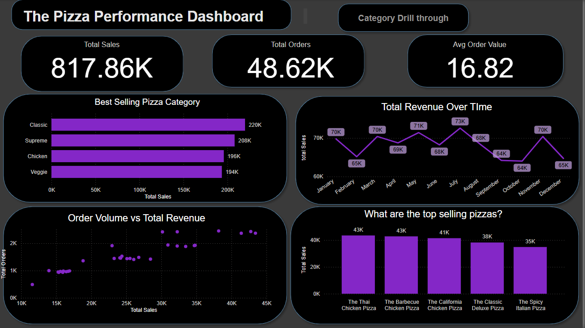

# 🍕 Pizza Sales Dashboard – Power BI Project

This project analyzes a pizza sales dataset to uncover valuable business insights through an interactive Power BI dashboard. It simulates how a pizza company can track performance and make data-driven decisions.

---

## 📁 Dataset

The dataset used includes historical pizza order details such as:
- Order ID
- Order Date
- Pizza Type
- Size
- Quantity
- Unit Price
- Total Price

All data is stored in a single flat table format.

---

## 🎯 Project Objectives

- Analyze **hourly and daily sales patterns**
- Track **monthly revenue trends**
- Identify **top 10 best-selling pizzas**
- Break down **sales by pizza size and category**
- Compare **order volume vs revenue**
- Calculate **Average Order Value (AOV)**
- Visualize key KPIs for business stakeholders

---

## 📊 Dashboard Features

- **KPI Cards** for total revenue, total orders, and AOV
- **Line Chart** for monthly sales trends
- **Bar Charts** for top-performing pizzas
- **Treemap** for revenue by pizza size
- **Scatter Plot** showing order volume vs revenue
- **Time-based patterns** using bar and line charts
- **Interactive filters** by category, size, and date

---

## 🛠️ Tools & Skills Used

- **Power BI** – Data Modeling, Visualizations, DAX
- **Excel** – Data Preparation & Cleaning
- **DAX** – Custom Measures and Calculated Columns
- **Data Storytelling** – Insightful visual structure for business users

---

## 📌 Key Insights

- Medium-sized pizzas drive the highest revenue
- Most orders are placed during lunch and dinner hours
- A few specific pizza types dominate total sales
- AOV is consistently increasing month over month

---

## 🔗 Project Link

> 💻 **Dashboard Screenshots & PBIX file:**  

[Pizza Sales Dashboard
](pizza.pbix)

---

## 📬 Contact

**Muhamed Badhusha**  
📧 muhamedbadhusha.s@gmail.com  
🔗 [LinkedIn](https://www.linkedin.com/in/muhamedbadhusha)

---

## 🏷️ Tags

`Power BI` `Data Analytics` `Dashboard` `Pizza Sales` `Business Intelligence` `Portfolio Project`
